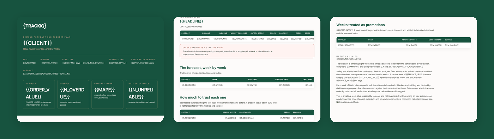

# TrackIQ: Amazon Demand Forecast and Reorder Plan

`trackiq-restock-priority` answers *what is about to run out*. This answers the harder question that comes next: **how much do we order, and by when?**

Forecast, then safety stock, then order quantity, then order date.

Part of **Amazon Inventory** in the
[TrackIQ skills catalog](https://github.com/TrackIQ-HQ/amazon-seller-skills).

Built as an [Agent Skill](https://code.claude.com/docs/en/skills). Runs in
Claude Code, Claude web, Claude desktop and ChatGPT from the same folder.

---

## Powered by the TrackIQ MCP

[](https://trackiq.com/mcp)

This skill reads your live Amazon account through the
**[TrackIQ MCP](https://trackiq.com/mcp)** — 16 tools connecting your AI
assistant to Amazon data:

Sales & Traffic · Orders · Inventory · Returns · Sponsored Products · Sponsored
Brands · Sponsored Display · Amazon DSP · AMC Cloud · Keywords · Search Terms ·
Targeting · Search Query Performance · Organic Rank · Best Seller Rank · Buy Box
History · Brand Analytics · Export

Works with Claude, ChatGPT and Cursor. **[Get access →](https://trackiq.com/mcp)**

---

## What you get



Turns trailing sales and last year's seasonal shape into a week-by-week demand forecast per Amazon product, then converts it into order quantities and order-by dates that account for lead time, safety stock and the service level the brand wants — with the forecast error stated so nobody treats it as certain. Use when the user asks how much to order, a demand forecast, a reorder plan, purchase order planning, safety stock, how much inventory to buy, or planning for a seasonal peak.

### The rules that keep it honest

- **Branch on `account_type` before calling anything**
- **No daily series exists**
- **Say how much history was actually available**
- **Every forecast ships with its error**

The full list is in `SKILL.md`, and each one exists because getting it wrong
produces a confident, wrong answer rather than an obvious error.

## Requirements

- The TrackIQ MCP, for `list_marketplaces`, `get_product_performance` and `get_inventory_snapshot`. - **A lead time** and **a service level** — ask for both. Defaults 45 days and 95%, labelled assumptions. - Nothing else. No filesystem, no shell, no internet. `assets/forecast.py` computes it if a shell is available; the method is in prose either way. - **Without the MCP:** works from 13 months of weekly or monthly units by ASIN plus a current inventory export.

---

## Install

### Claude Code

```
/plugin marketplace add TrackIQ-HQ/amazon-seller-skills
/plugin install trackiq-amazon-demand-forecast@trackiq
```

### Claude web, desktop, mobile

1. Download the `.zip` from the
   [latest release](https://github.com/TrackIQ-HQ/trackiq-amazon-demand-forecast/releases)
2. **Settings → Capabilities → Skills** (code execution must be on)
3. **Create skill → Upload a skill**, choose the `.zip`
4. Toggle it on

### ChatGPT

Same zip. **Plugins → Skills → Create → Upload from your computer.**

---

## Setup

Answers live in `account.md`, copied from
[`assets/account.example.md`](skills/trackiq-amazon-demand-forecast/assets/account.example.md).
**Every TrackIQ skill reads the same file**, so an account already set up for
another TrackIQ report needs nothing added.

## Delivery

Asked once and stored in `account.md`: **in-chat** (default), **file**,
**Slack**, **n8n** or **email**. Anything leaving the chat confirms with you
first and falls back to in-chat, with a note.

---

## Customizing

| File | What it controls |
|---|---|
| `checks.md` | the pre-send checks |
| `forecast.py` | the bundled script |
| `method.md` | the method and every threshold |
| `pulls.md` | the call sequence and its traps |
| `report-template.html` | the report shell |

---

## Contributing

```bash
python scripts/validate.py    # must exit 0 before any commit
python scripts/build.py       # writes dist/ zip + registry.json
```

Read [AUTHORING.md](https://github.com/TrackIQ-HQ/amazon-seller-skills/blob/main/AUTHORING.md)
before proposing changes.

## License

MIT. See [LICENSE](LICENSE).
